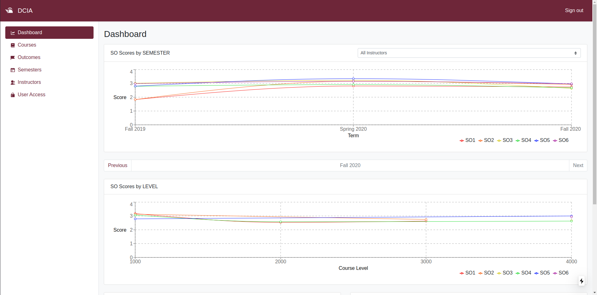

# DCIA

**D**epartment **C**ontinuous **I**mprovement **A**pplication (DCIA) is a web
application developed for coursework at the University of Arkansas at Little
Rock that tracks student outcomes across semesters and instructors.

## Screenshots

### Sign In / Register

### Dashboard

### User Access Management

### Courses Page

## Application Stack

DCIA leverages a variation of the MERN stack through the following technologies:

- [NextJS](https://nextjs.org): JavaScript framework that packages a ReactJS driven frontend with an ExpressJS-like backend, providing support for hybrid rendering, API endpoints, and optimized bundling.
- [MongoDB Atlas](https://www.mongodb.com/cloud/atlas): Document-based database hosted in the cloud and accessed through the Mongoose client.

In addition, the application makes use of a few other notable Node packages:

- [Mongoose](https://mongoosejs.com/): Schema-based ODM for MongoDB.
- [Recharts](http://recharts.org/en-US/): Data visualization library for our line and bar charts, built on top of D3.js.
- [Sendgrid](https://github.com/sendgrid/sendgrid-nodejs): Node package to interface with Twilio's Sendgrid email service to allow for transactional emails.
- [SWR](https://swr.vercel.app/): Vercel's React hooks library for data fetching.
- [React-Bootstrap](https://react-bootstrap.github.io/): Bootstrap styles via React components.
- [Faker.js](https://github.com/marak/Faker.js/): Allowed for mostly programmatic generation of fake student, assessment, and instructor data.
